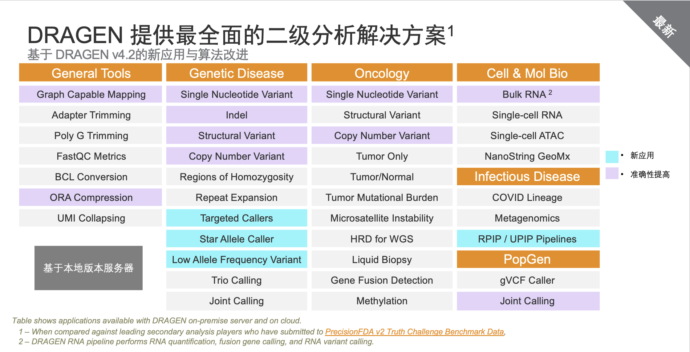

# dragen学习资料汇总

## 文档

- [dragen在线帮助文档](https://support-docs.illumina.com/SW/dragen_v42/Content/SW/FrontPages/DRAGEN.htm)
- [dragen软件下载](https://sapac.support.illumina.com/sequencing/sequencing_software/dragen-bio-it-platform.html?langsel=/my/)
- [dragen-bio-it-platform-Getting Started Guide.pdf](Dcouments/dragen-bio-it-platform-Getting-Started-Guide.pdf)
- [dragen-platform-v4.2-guide.pdf](Dcouments/dragen-platform-v4.2-guide.pdf)
- [4.2-Customer-Release-Notes.pdf](Dcouments/4.2-Customer-Release-Notes.pdf)

## 流程使用说明

- [数据拆分](bcl2fastq/README.md)
- [遗传病WGS](WGS_germline/README.md)
- [遗传病WES](WES_germline/README.md)
- [数据压缩](ora-compression/README.md)
- [RPIP](RPIP/README.md)
- [参考基因组](hash_build/README.md)
- [测序系统误差](Systematic_noise_filtering/README.md)
- [体细胞-tumor-only](somatic_tumor_only/README.md)
- [体细胞-tumor vs normal](somatic_tumor_normal/README.md)
- [变异注释](./annotation/README.md)
- [RNAseq数据分析](./RNAseq/README.md)
- [第三方工具兼容](./Third-party-tools/README.md)

## Explore recent

[DRAGEN publications](https://developer.illumina.com/news-updates/dragen-publications) 

[Illumina DRAGEN Bio-IT Platform Product Files](https://sapac.support.illumina.com/sequencing/sequencing_software/dragen-bio-it-platform/product_files.html)

[Behera S, Catreux S, Rossi M, et al. Comprehensive and accurate genome analysis at scale using DRAGEN accelerated algorithms[J]. bioRxiv, 2024: 2024.01. 02.573821.](https://www.biorxiv.org/content/10.1101/2024.01.02.573821v2.abstract)

## Resource

a population SNP VCF， can be used *--cnv-population-b-allele-vcf* option

[1000G_phase1.snps.high_confidence.b37.vcf.gz](https://storage.googleapis.com/gcp-public-data--broad-references/hg19/v0/1000G_phase1.snps.high_confidence.b37.vcf.gz)

[1000G_phase1.snps.high_confidence.hg38.vcf.gz](https://storage.googleapis.com/gcp-public-data--broad-references/hg38/v0/1000G_phase1.snps.high_confidence.hg38.vcf.gz)

## Technical Assistance

Email: techsupport@illumina.com

## Illumina Technical Support Telephone Numbers

|Region | Toll Free |International|
|-------|-----------|------------|
|china |           | +86 400 066 5835|