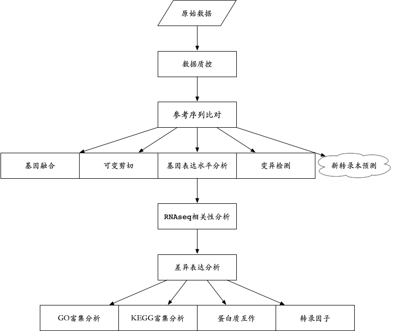
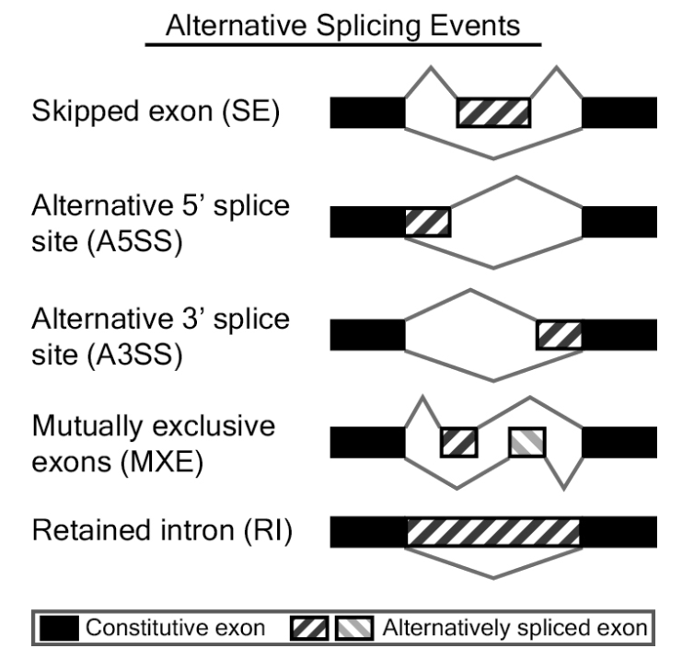

# RNA 数据分析: 表达定量 +可变剪切+基因融合+变异检测
```cs
dragen -f –r ${1} -1 ${2} -2 ${3} \
--output-file-prefix ${4} --output-directory ${5} \
--RGID RGID --RGSM ${4} \
--annotation-file ${6} \
--rrna-filter-enable=true \
--enable-duplicate-marking=true \
--dupmark-version=hash \
--enable-rna=true \
--enable-variant-caller=true \
--enable-rna-gene-fusion true \
--enable-rna-quantification true
```

# GFF3/GTF注释文件下载:https://www.gencodegenes.org/

# 结果输出
```cs
基因水平表达定量        <prefix>.quant.genes.sf
转录本表达量           <prefix>.quant.sf
可变剪切              <prefix>.SJ.out.tab
基因融合              <prefix>.fusion_candidates.final
变异检测              <prefix>.hard-filtered.vcf.gz
```

# appendix



## 测序深度

https://med.virginia.edu/bioinformatics-core/services/gene-expression-rna-seq/

20M：focus on expression at the gene level

100M：examine novel and rarely expressed transcripts，2 x 76 bp or longer reads is currently recommended

个人建议：至少30 Million reads per sample

##  融合分析

STAR-fusion与Arriba最佳

[Haas B J, Dobin A, Li B, et al. Accuracy assessment of fusion transcript detection via read-mapping and de novo fusion transcript assembly-based methods[J]. Genome biology, 2019, 20(1): 1-16.](https://genomebiology.biomedcentral.com/articles/10.1186/s13059-019-1842-9?ref=https://githubhelp.com)

[Creason A, Haan D, Dang K, et al. A community challenge to evaluate RNA-seq, fusion detection, and isoform quantification methods for cancer discovery[J]. Cell systems, 2021, 12(8): 827-838. e5.](https://www.cell.com/cell-systems/pdf/S2405-4712(21)00207-6.pdf)

## 差异表达分析

DESeq2, a robust version of edgeR (edgeR.rb), voom with TMM normalization (voom.tmm) and sample weights (voom.sw) showed an overall good performance regardless of presence of outliers and proportion of DE genes.

[Baik B, Yoon S, Nam D. Benchmarking RNA-seq differential expression analysis methods using spike-in and simulation data[J]. PLoS One, 2020, 15(4): e0232271.](https://journals.plos.org/plosone/article?id=10.1371/journal.pone.0232271)

[Owens N D L, De Domenico E, Gilchrist M J. An RNA-seq protocol for differential expression analysis[J]. Cold Spring Harb Protoc, 2019, 2019(6): 10.](https://www.researchgate.net/profile/Elena-De-Domenico/publication/333586839_An_RNA-Seq_Protocol_for_Differential_Expression_Analysis/links/5f1065daa6fdcc3ed70b9b4c/An-RNA-Seq-Protocol-for-Differential-Expression-Analysis.pdf)

## 变异检测

[GATK:RNAseq short variant discovery SNPs+Indels](https://gatk.broadinstitute.org/hc/en-us/articles/360035531192-RNAseq-short-variant-discovery-SNPs-Indels-)

## 可变剪切



ASprofile+rMATS

[Halperin R F, Hegde A, Lang J D, et al. Improved methods for RNAseq-based alternative splicing analysis[J]. Scientific reports, 2021, 11(1): 10740.](https://www.nature.com/articles/s41598-021-89938-2)

## 参考文献

[Conesa A, Madrigal P, Tarazona S, et al. A survey of best practices for RNA-seq data analysis[J]. Genome biology, 2016, 17(1): 1-19.](https://genomebiology.biomedcentral.com/articles/10.1186/s13059-016-0881-8?ref=https://githubhelp.com)

[Marco-Puche G, Lois S, Benítez J, et al. RNA-Seq perspectives to improve clinical diagnosis[J]. Frontiers in genetics, 2019, 10: 1152.](https://www.frontiersin.org/articles/10.3389/fgene.2019.01152/full)

[Creason A, Haan D, Dang K, et al. A community challenge to evaluate RNA-seq, fusion detection, and isoform quantification methods for cancer discovery[J]. Cell systems, 2021, 12(8): 827-838. e5.](https://www.cell.com/cell-systems/pdf/S2405-4712(21)00207-6.pdf)

[Garrido-Rodriguez M, Lopez-Lopez D, Ortuno F M, et al. A versatile workflow to integrate RNA-seq genomic and transcriptomic data into mechanistic models of signaling pathways[J]. PLoS computational biology, 2021, 17(2): e1008748.](https://journals.plos.org/ploscompbiol/article?id=10.1371/journal.pcbi.1008748)

[Zhang J, Rashmi R, Inkman M, et al. Integrating imaging and RNA-seq improves outcome prediction in cervical cancer[J]. The Journal of Clinical Investigation, 2021, 131(5).](https://www.jci.org/articles/view/139232)

[Shen Z, Du W, Perkins C, et al. Platelet transcriptome identifies progressive markers and potential therapeutic targets in chronic myeloproliferative neoplasms[J]. Cell Reports Medicine, 2021, 2(10).](https://www.cell.com/cell-reports-medicine/pdf/S2666-3791(21)00287-1.pdf)

