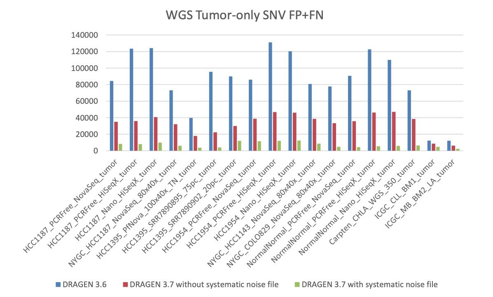
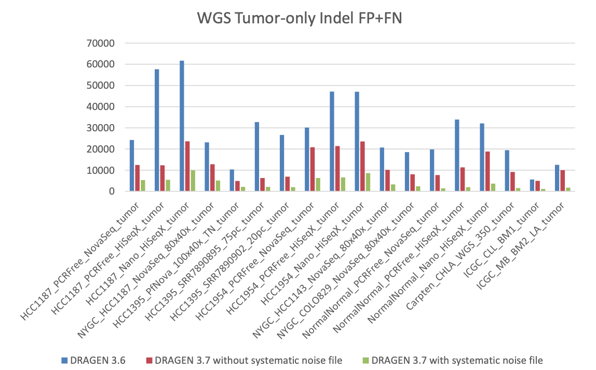

# 过滤测序系统误差

可以减少假阳性





已有文件下载：https://sapac.support.illumina.com/sequencing/sequencing_software/dragen-bio-it-platform/product_files.html

1. 该分析过程可用于Tumor-Normal or Tumor-Only somatic mode

2. 选取正常样本,以tumor only的方式运行
```{.cs}
    dragen -f -r ${1} --tumor-fastq1 ${2} --tumor-fastq2 {3} \
    --RGID-tumor RG0-tumor -–RGSM-tumor SM0-tumor \
    --enable-variant-caller true \
    --output-directory ${4} \
    --output-file-prefix ${5} --vc-detect-systematic-noise true
```

3. 将正常样本生成的vcf放在一个list文件中，一行一个vcf文件,最终生成bed文件 ::
```{.cs}
    dragen -f --ref-dir=${1}    --output-dir=${2} --output-file-prefix=${3}
        --enable-map-align=false --enable-sort=true \
        --vc-systematic-noise-raw-input-list=${4} 
        --vc-systematic-noise-method=aggregate \
        --vc-systematic-noise-use-germline-tag=true \
        --bin_memory=40000000000 --watchdog-active-timeout=8000 --watchdog-idle-timeout=8000

        备注：**--vc-systematic-noise-method**：
        WGS(max)
        WES(aggregate)
        panel(mean)
```

4. 在call变异的时候指定参数
```{.cs}
    **--vc-systematic-noise <prefix>.systematic_noise.bed.gz**
    tumor-normal:<br>**--vc-systematic-noise-filter-threshold 10**
    tumor only:<br>**--vc-systematic-noise-filter-threshold 60**
```{.cs}
