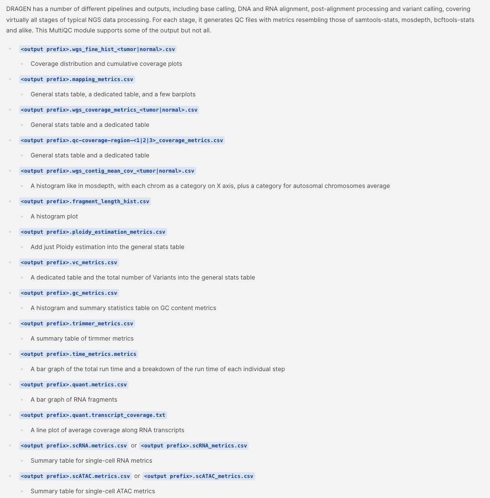
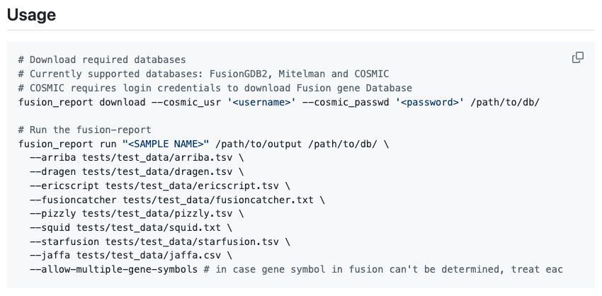
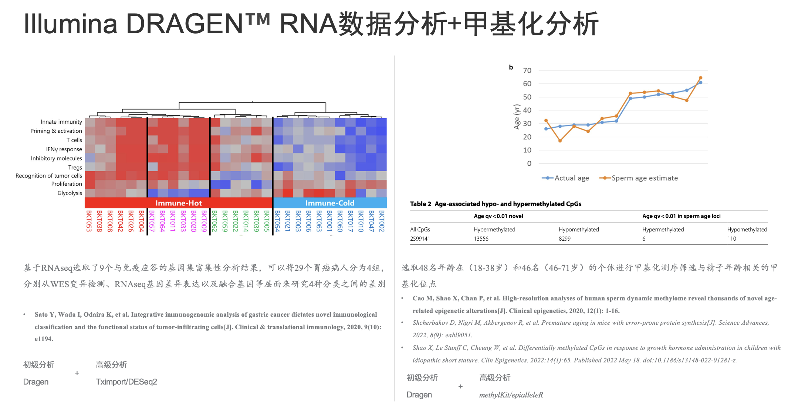
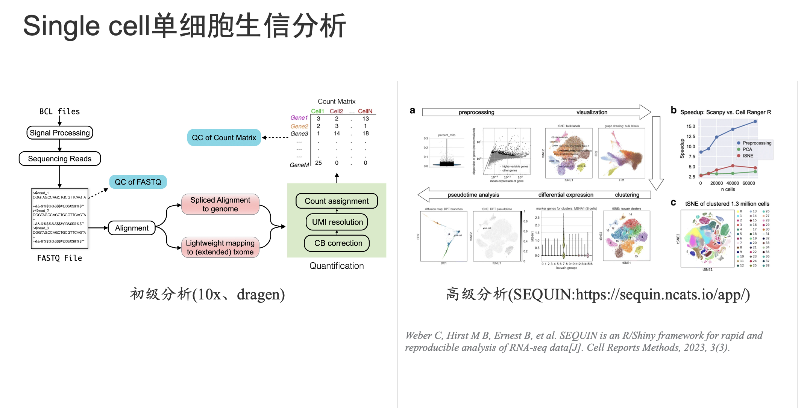

# 数据质控工具MultiQC

[MultiQC searches a given directory for analysis logs and compiles a HTML report. It's a general use tool, perfect for summarising the output from numerous bioinformatics tools.](https://multiqc.info/)

# 基因融合工具

[Fusion-report is part of a bigger project nf-core/rnafusion which is designed to detect and report fusion genes from RNA-seq data.](https://github.com/Clinical-Genomics/fusion-report)

# RNAseq差异表达+甲基化数据分析

RNA:Draggen+**Tximport/DESeq2**

Methylation:Dragen+**methylKit/epialleleR**

# 单细胞数据分析

Dragen+[SEQUIN:https://sequin.ncats.io/app/](https://sequin.ncats.io/app/)

