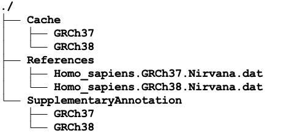

**Download Data Files**
```{.cs}
mkdir /staging/nirvana/
/opt/edico/share/nirvana/Downloader --ga GRCh38 --out /staging/nirvana/
                        or
/opt/edico/share/nirvana/Downloader --ga GRCh37 --out /staging/nirvana/
                        or
/opt/edico/share/nirvana/Downloader --ga both --out /staging/nirvana/                       
```

**output directory**




**All the command-line arguments shown together**
```{.cs}
--enable-variant-annotation=true \
--variant-annotation-data=/path/to/your/NirvanaData \
--variant-annotation-assembly=GRCh38
```

**Output:**
```{.cs}
<prefix>.json.gz
```

**parse json file**

Parse Nirvana JSON output in python:

https://github.com/Illumina/NirvanaDocumentation/blob/master/static/files/parse-nirvana-json-python.ipynb

Parse Nirvana JSON output in R:

https://github.com/Illumina/NirvanaDocumentation/blob/master/static/files/parse-nirvana-json-r.ipynb