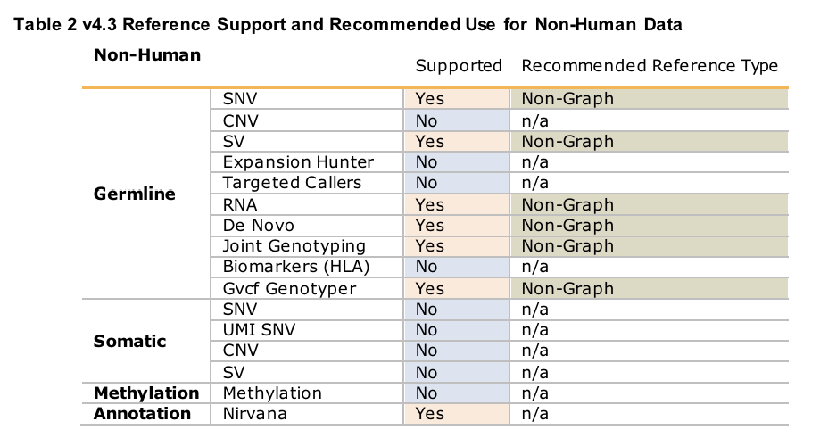

# 1.人类参考基因组


构建图形基因Graph references的参数：*--ht-apply-graph=true*

## 建议在线下载
<https://sapac.support.illumina.com/sequencing/sequencing_software/dragen-bio-it-platform/product_files.html>

## 本地构建
### hg19
DNA+CNV+RNA
```cs
    dragen --output-directory /staging/hash_table/human/hg19_CNV_RNA/ \
    --build-hash-table true --ht-reference hg19.fa \
    --ht-alt-liftover /opt/edico/liftover/hg19_alt_liftover.sam \
    --ht-decoys /opt/edico/liftover/hs_decoys.fa \
    --enable-cnv true --ht-num-thread 40 \
    --ht-build-rna-hashtable true
```
methylation
```cs
    dragen --output-directory /staging/hash_table/human/hg19_methylation/ \
    --build-hash-table true --ht-reference hg19.fa \
    --ht-alt-liftover /opt/edico/liftover/hg19_alt_liftover.sam \
    --ht-decoys /opt/edico/liftover/hs_decoys.fa \
    --ht-num-thread 40 --ht-methylated true \
    --ht-methylated-combined=true
```
### hg38
DNA+CNV+RNA
```cs
    dragen --output-directory /staging/hash_table/human/hg38_CNV_RNA/ \
    --build-hash-table true --ht-build-rna-hashtable true \
    --enable-cnv true --ht-reference hg38.fa \
    --ht-num-threads 40 --ht-alt-liftover /opt/edico/liftover/bwa-kit_hs38DH_liftover.sam \
    --ht-pop-alt-contigs /opt/edico/liftover/pop_altContig.fa.gz \
    --ht-pop-alt-liftover /opt/edico/liftover/pop_liftover.sam.gz \
    --ht-pop-snps /opt/edico/liftover/pop_snps.vcf.gz
```
methylation
```cs
    dragen --output-directory /staging/hash_table/human/hg38_methylation/ \
    --build-hash-table true --ht-reference hg38.fa \
    --ht-alt-liftover /opt/edico/liftover/bwa-kit_hs38DH_liftover.sam \
    --ht-decoys /opt/edico/liftover/hs_decoys.fa \
    --ht-num-thread 40 --ht-methylated true
```

## fasta文件下载

**hg19:**<https://ilmn-dragen-giab-samples.s3.amazonaws.com/FASTA/hg19.fa>

**hg38:**<https://ilmn-dragen-giab-samples.s3.amazonaws.com/FASTA/hg38.fa>

**hs37d5:**<https://ilmn-dragen-giab-samples.s3.amazonaws.com/FASTA/hs37d5.fa>


# 2. 非人物种



构建图形基因Graph references的参数：*--ht-apply-graph=true*

DNA+CNV+RNA
```cs
    dragen --output-directory /staging/to/###_CNV_RNA/ \
    --build-hash-table true --ht-reference ##.fa \
    --enable-cnv true \
    --ht-num-thread 40 --ht-build-rna-hashtable true
```
methylation
```cs
    dragen --output-directory /staging/to/###_methylation/ \
    --build-hash-table true --ht-reference ###.fa \
    --ht-num-thread 40 --ht-methylated true \
    --ht-methylated-combined=true
```
