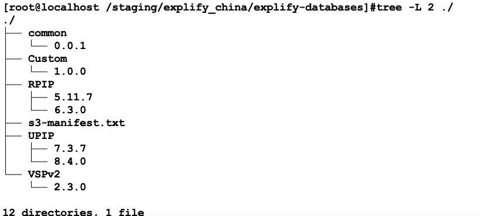

# 1.dragen数据库下载

下载脚本
```{.cs}
mkdir -p /staging/explify_china/explify-databases/
cd /staging/explify_china/
wget -O explify-dbs.sh https://illumina-explify-databases.s3.us-east-1.amazonaws.com/explify-dbs.sh
chmod +x explify-dbs.sh

./explify-dbs.sh search -d explify-databases/
    version=1.0.3
    Downloading manifest file to explify-databases/s3-manifest.txt
    6 database(s) found meeting those criteria:
    - RPIP-5.11.7
    - UPIP-7.3.7
    - Custom-1.0.0
    - RPIP-6.3.0
    - VSPv2-2.3.0
    - UPIP-8.4.0
```
数据库下载
```{.cs}
./explify-dbs.sh download -d explify-databases/ -p UPIP -v 8.4.0 -n 20
./explify-dbs.sh download -d explify-databases/ -p RPIP -v 6.3.0 -n 20
./explify-dbs.sh download -d explify-databases/ -p VSPv2 -v 2.3.0 -n 20
./explify-dbs.sh download -d explify-databases/ -p Custom -v 1.0.0 -n 20
```
check数据库
```{.cs}
./explify-dbs.sh check -d explify-databases/ -p Custom -v 1.0.0
./explify-dbs.sh check -d explify-databases/ -p UPIP -v 8.4.0
./explify-dbs.sh check -d explify-databases/ -p VSPv2 -v 2.3.0
./explify-dbs.sh check -d explify-databases/ -p RPIP -v 6.3.0
```
数据库目录结构

{width=200}


备注：这个数据库非常大大概70G，如果客户安端装建议下载到移动硬盘给客户

# 2.dragen v4.3安装

<https://sapac.support.illumina.com/downloads/illumina-dragen-bio-it-platform-v4-3.html>

# 3.docker镜像
```
docker build -t covlineages/pangolin ./
```

# 4.demo shell

```{.cs}
/opt/edico/bin/dragen \
  --enable-explify=true \
  --output-file-prefix RPIP_test \
  --explify-sample-list ${1} \
  --explify-test-panel-name "RPIP" \
  --explify-test-panel-version 5.11.7 \
  --explify-ref-db-dir /staging/explify_china/explify-databases/ \
  --explify-load-db-ram=true \
  --output-directory ${2} \
  --explify-ncpus=48
```

**sample list实例**

| SampleID* | 	BatchID | RunID | ControlFlag | FastQs*                           |                                   |
|-----------|----------|-------|-------------|------------------------------------|------------------------------------|
| 57        | 57       | 57    |             | /path/to/57\_S10\_R1\_001.fastq.gz | /path/to/57\_S10\_R2\_001.fastq.gz |
| 56        | 56       | 56    |             | /path/to/56\_S10\_R1\_001.fastq.gz | |

备注：\*代表必填项

# 5. 输出文件json解析
```{.cs}
python3 parse_micro.py --help
usage: This script will parse dragen v4.3 VSPv2/RPIP/UPIP json file.
 [-h] -j JSON [-o OUTDIR]

options:
  -h, --help            show this help message and exit
  -j JSON, --json JSON  json file from dragen v4.3 VSPv2/RPIP/UPIP
  -o OUTDIR, --outdir OUTDIR
                        output directory
```