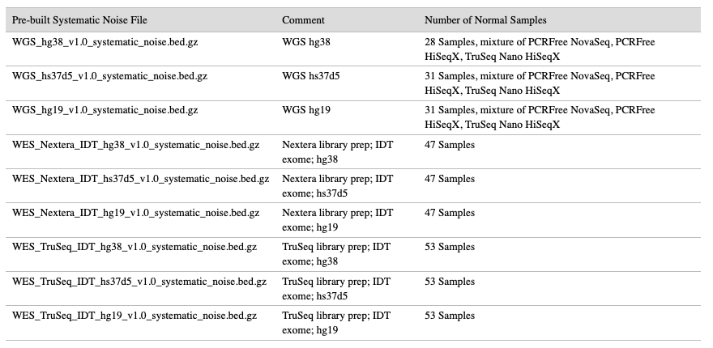

# enrichment
```{.cs}
dragen -f -r ${1} --tumor-fastq1=${2} --tumor-fastq2=${3} \
--RGID-tumor RGID --RGSM-tumor ${4} --output-directory ${5} --output-file-prefix ${4} \
--enable-duplicate-marking true --enable-sort true --output-format BAM --enable-map-align true \
--enable-map-align-output true --enable-bam-indexing true \
--enable-variant-caller true --vc-target-bed=${6} \
--enable-cnv true --cnv-target-bed ${6} --cnv-normals-list ${7} \
--cnv-segmentation-bed ${8} --cnv-segmentation-mode bed \
--cnv-filter-limit-of-detection 0.2 --cnv-filter-length 1000 \
--cnv-enable-gcbias-correction false --cnv-interval-width 100 \
--enable-sv true --sv-call-regions-bed ${6} \
--sv-exome true --sv-use-overlap-pair-envidence true \
--sv-somatic-ins-tandup-hotspot-regions-bed /opt/edico/config/sv_somatic_ins_tandup_hotspot_hg19.bed \
--high-coverage-support-mode true
```

**parameter**
```{.cs}
/opt/edico/config/sv_somatic_ins_tandup_hotspot_GRCh37.bed
/opt/edico/config/sv_somatic_ins_tandup_hotspot_GRCh38.bed
/opt/edico/config/sv_somatic_ins_tandup_hotspot_hg19.bed
```

**Systematic Noise Filtering**
```{.cs}
--vc-systematic-noise /path/to/WGS_hg38_v1.0_systematic_noise.bed.gz
```
Download Prebuilt file:
[Illumina DRAGEN Systematic Noise Files](https://sapac.support.illumina.com/sequencing/sequencing_software/dragen-bio-it-platform/product_files.html)



**Germline filtering**
```{.cs}
--vc-enable-germline-tagging=true \
--enable-variant-annotation=true \
--variant-annotation-data /path/to/nivarna/ \
--variant-annotation-assembly GRch38
```